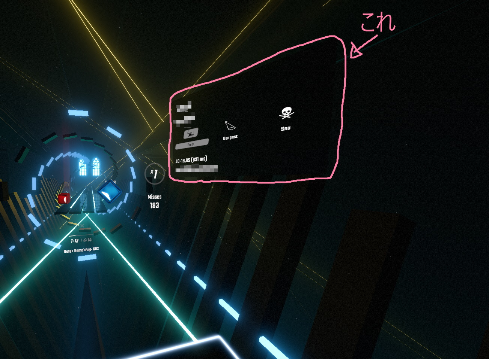
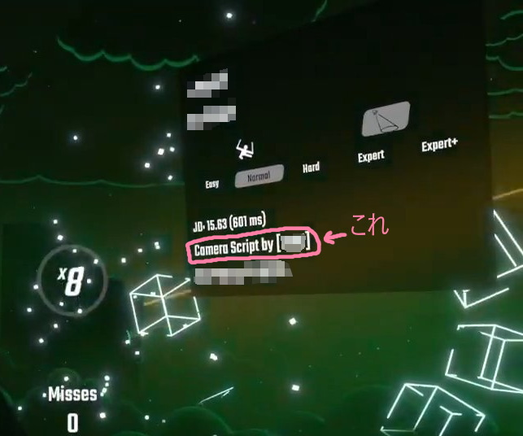

# StandaloneBeatmapInformation

プレイ中のマップ情報を表示します。

## 概要
これ↓

- プレイ時に **マップ情報を表示するパネル** を空間上に置けます。
- 曲開始時に情報を取得するための **インターネット接続をしません** 。
- Diffs(難易度)やCharacteristics(Normal/360°/Lawlessなど)は、プレイ中のものだけではなく、 **選択可能なものも全部表示** されます。
- DiffsやCharacteristicsの **表記はゲーム内と同じ** になります。
- ランクマップの場合は **星を表示** できます。
- プレイ時の **JD値を表示** できます。
- `IndependentBsr` と一緒に使うと、 **リクエスト受付状態・リクエスタの名前** を表示できます。
- `CameraPlusMovementScriptBox` と一緒に使うと、 **カメラスクリプトの作者** を表示できます。(v0.2.1から)

  

## 動作環境
ゲーム本体の対応バージョンと依存MODは [manifest.json](StandaloneBeatmapInformation/manifest.json) を見てください。

特に以下のMODはよく確認しましょう。
- BS Utils
- SongDetailsCache

## インストール
`StandaloneBeatmapInformation.dll` を `Plugins` フォルダに置くだけ。

## 使い方
マップをプレイすると勝手にパネルが表示されます。
見つからないときは空間上のどこかにあるので頑張って探してください。

位置を調整したいとき：
- MOD Settingsにある `Enable handle` を有効にしてください。
- マップをプレイするとコントローラで掴めるハンドルが表示されるので、好きな位置に移動してください。場所は勝手に記憶されます。
- 調整が終わったら、また `Enable handle` を無効にしてください。
